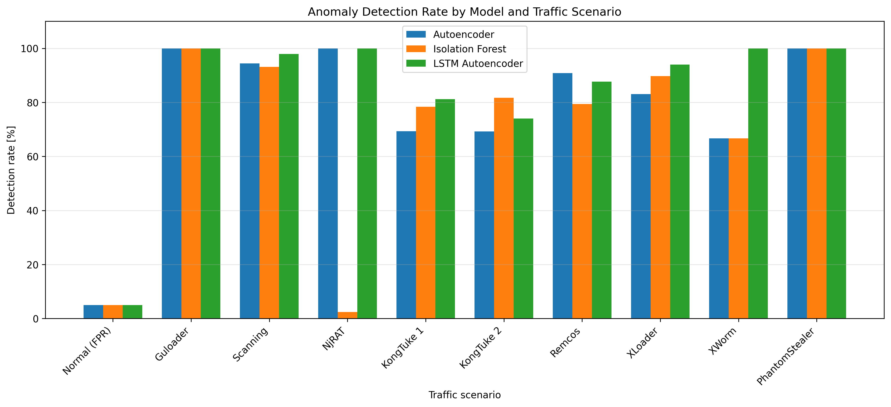
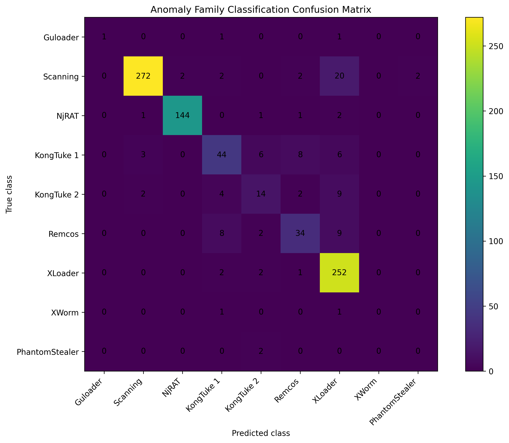

# Encrypted Network Traffic Anomaly Detection

Master's thesis project focused on detecting anomalous behaviour in encrypted
network traffic using network-flow metadata, without decrypting traffic or
inspecting packet payloads.

The project implements a complete anomaly-detection pipeline based on data
extracted from Zeek `conn.log` files and compares multiple unsupervised
machine-learning approaches.

## Overview

The main goal of the project was to investigate whether anomalies in encrypted
network traffic can be detected using connection-level metadata alone.

The pipeline includes:

1. Network-flow extraction using Zeek
2. Data preprocessing and feature engineering
3. Autoencoder-based anomaly detection
4. Isolation Forest baseline
5. LSTM Autoencoder experiments
6. Model comparison and evaluation
7. Anomaly-family classification using Autoencoder embeddings
8. Performance benchmarking
9. A near-real-time detection prototype

## Models

### Autoencoder
A reconstruction-based neural network implemented in PyTorch. Reconstruction
error is used as the anomaly score.

### Isolation Forest
A classical unsupervised anomaly-detection algorithm used as a baseline for
comparison with neural-network approaches.

### LSTM Autoencoder
A sequence-based reconstruction model used to analyse temporal patterns in
network flows.

### Anomaly Family Classifier
A Random Forest classifier trained on latent representations generated by the
Autoencoder to distinguish between different anomaly families.

## Technologies

- Python
- PyTorch
- scikit-learn
- pandas
- NumPy
- Zeek
- Jupyter Notebook
- Matplotlib

## Repository Structure

```text
EncryptedTraffic-AnomalyDetection/
├── notebooks/          # Data processing, training and evaluation
├── models/             # Trained machine-learning models
├── results/            # Experiment results and generated figures
├── feature_schema.csv
├── standard_scaler.pkl
├── realtime_full_demo.py
├── requirements.txt
└── README.md
```

## Experimental Pipeline

The notebooks are organised in execution order:

```text
01_build_normal_dataset.ipynb
02_build_anomaly_features.ipynb
03_autoencoder.ipynb
04_isolation_forest.ipynb
05_lstm_autoencoder.ipynb
06_model_comparison.ipynb
07_family_classification_analysis.ipynb
08_train_family_classifier.ipynb
09_final_results.ipynb
10_performance_benchmark.ipynb
11_generate_figures.ipynb
```
## Results

The evaluated models achieved high anomaly-detection rates across multiple
network-traffic scenarios while maintaining an approximately 5% false-positive
rate on normal traffic.

| Scenario | Autoencoder | Isolation Forest | LSTM Autoencoder |
|---|---:|---:|---:|
| Normal traffic (FPR) | 4.99% | 5.00% | 5.00% |
| Guloader | 100.00% | 100.00% | 100.00% |
| Scanning | 94.38% | 93.18% | 97.88% |
| NjRAT | 100.00% | 2.41% | 100.00% |
| Remcos | 90.86% | 79.43% | 87.72% |
| XLoader | 83.04% | 89.71% | 94.01% |
| PhantomStealer | 100.00% | 100.00% | 100.00% |



The results show that no single model performed best for every anomaly
scenario. The LSTM Autoencoder achieved the strongest overall detection
performance, while the standard Autoencoder provided strong results together
with a simpler inference pipeline suitable for the near-real-time prototype.

The anomaly-family classifier, trained on 32-dimensional latent Autoencoder
embeddings, achieved approximately **88.1% classification accuracy** on the
test set.



## Data

The project operates on features extracted from network traffic using Zeek.

Raw PCAP files and full datasets are not included in this repository due to
their size. The repository contains the preprocessing pipeline, trained models,
experiment results and feature schema required to understand the implementation.

## Near-Real-Time Prototype

`realtime_full_demo.py` demonstrates a prototype processing pipeline in which:

1. a PCAP sample is processed by Zeek,
2. connection-level features are extracted,
3. the Autoencoder calculates an anomaly score,
4. anomalous flows are detected using a predefined reconstruction-error threshold,
5. the anomaly-family classifier attempts to identify the anomaly type.

The prototype uses Zeek through WSL on Windows.

## Installation

Install the required Python packages:

```bash
pip install -r requirements.txt
```

Zeek is additionally required for processing raw network captures.

## Author

**Radosław Witkowski**

MSc Computer Science  
University of Łódź